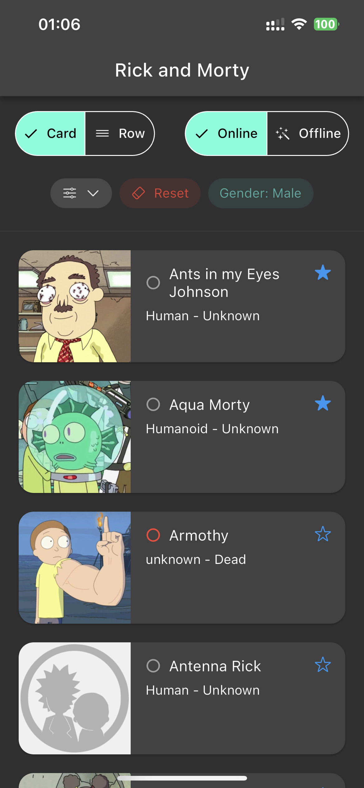
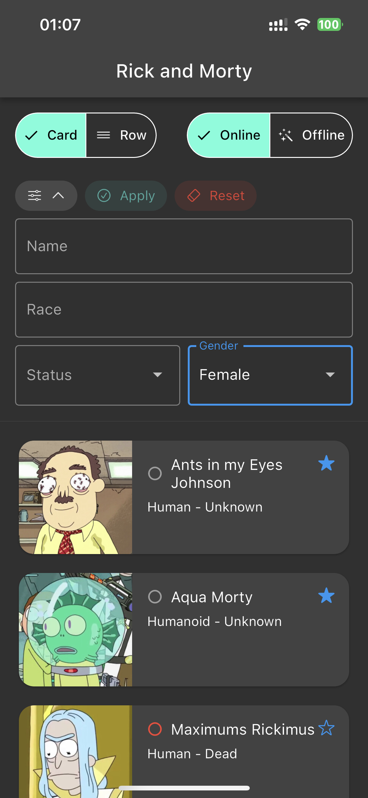
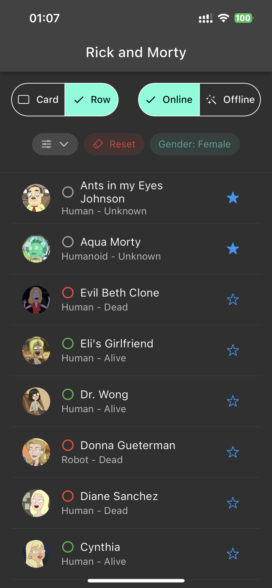

# Rick and Morty Flutter client 
## Platforms: Android, iOS, Web, MacOS
## Features:
- List of characters filtered by name, gender, status and race
- Character card
- Ability to include a character in favorites
- Offline mode

## Used technologies:
- Retrofit
- Isar
- MobX
- GetIt + Injectable
- Freezed

## API:
https://rickandmortyapi.com/

## Screenshots:

